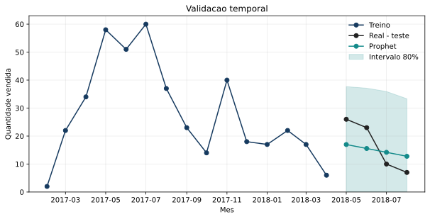
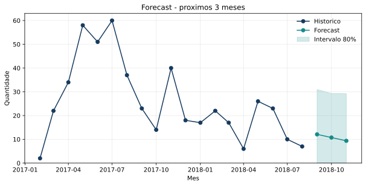

# Retail Demand Forecasting with Prophet

Monthly demand forecasting case developed as an academic group project at FIAP. The analysis evaluates whether a short historical series can support inventory and purchasing decisions without overstating model certainty.

## Business context

Retail teams need demand estimates to plan inventory, purchasing, pricing, promotions, and service levels. This project focuses on monthly unit demand (`qty`) for one product and treats the forecast as decision support rather than an automatic purchase order.

## Objective

- Build a monthly forecast for product `bed2`.
- Use a chronological train/test split to avoid temporal leakage.
- Compare Prophet with simple last-value and training-mean baselines.
- Translate forecast uncertainty into practical inventory guidance.

## Dataset

The project uses the public [Retail Price Optimization dataset](https://www.kaggle.com/datasets/suddharshan/retail-price-optimization), licensed as CC0 Public Domain on Kaggle.

- 676 product-month records and 30 columns
- 52 products across 9 categories
- Overall period: January 2017 to August 2018
- Main variables: product, month, quantity, unit price, freight, competitors, calendar, and product attributes
- Modeled series: `bed2`, with 19 consecutive monthly observations from February 2017 to August 2018

The small dataset is included in `data/` for reproducibility. See [data/README.md](data/README.md) for attribution and scope.

## Technologies

- Python
- Pandas and NumPy
- Prophet
- Matplotlib
- Jupyter

## Methodology

1. Audited coverage, duplicates, gaps, price changes, and outliers.
2. Selected a single product with a continuous and comparatively substantial history.
3. Renamed the time and target columns to Prophet's `ds` and `y` convention.
4. Used the first 15 months for training and the final 4 months for testing.
5. Disabled daily, weekly, and yearly seasonality because the data are monthly and contain fewer than two annual cycles.
6. Evaluated point forecasts with MAE, RMSE, MAPE, and sMAPE.
7. Compared the model with two naive baselines.
8. Refit the model on all 19 observations and produced a three-month forecast.

## Results

| Model | MAE | RMSE | MAPE | sMAPE |
|---|---:|---:|---:|---:|
| Prophet | **6.61** | **6.85** | **47.85%** | **43.40%** |
| Last-value baseline | 10.50 | 13.29 | 51.28% | 76.91% |
| Training-mean baseline | 11.57 | 14.14 | 127.90% | 60.64% |

Prophet reduced absolute error relative to both baselines, but the four-month test window and high percentage error make the result directional rather than production-ready.



The final model estimated demand of 12.09, 10.75, and 9.37 units for the next three months, with wide uncertainty intervals.



## Business interpretation

The declining short-term forecast supports cautious, staged replenishment rather than a large automatic order. A real purchasing decision should also account for current inventory, open orders, lead time, safety stock, stockout cost, holding cost, promotions, and planned price changes.

## Limitations

- Only 19 observations are available for the modeled product.
- The test set contains four months.
- Fewer than two annual cycles are available, so annual seasonality was not estimated.
- Missing product-month rows may mean zero sales, stockouts, or missing data; the dataset does not distinguish them.
- The univariate model does not estimate causal price or promotion effects.
- MAPE is unstable when actual demand is small.

## Project structure

```text
retail-demand-forecasting/
├── data/
│   ├── README.md
│   └── retail_price.csv
├── notebooks/
│   └── retail_demand_forecasting.ipynb
├── reports/
│   └── figures/
│       ├── temporal-validation.svg
│       └── three-month-forecast.svg
├── .gitignore
├── README.md
└── requirements.txt
```

## How to run

```bash
python -m venv .venv
```

Activate the environment, then run:

```bash
python -m pip install -r requirements.txt
jupyter lab notebooks/retail_demand_forecasting.ipynb
```

Restart the kernel and run all cells from top to bottom.

## Next steps

- Add rolling-origin backtesting when more history becomes available.
- Compare Prophet with seasonal naive, exponential smoothing, and autoregressive baselines.
- Model products separately or with a global forecasting approach.
- Add price, promotions, stock availability, and lead time as validated regressors.
- Define inventory decisions from service levels and asymmetric overstock/stockout costs.

## Authors

Academic group project developed at FIAP by:

- Daniel Gallo de Almeida Junior
- Tiago Sousa Leite

## Licensing

The dataset is provided under its source's CC0 Public Domain license. No separate software license is granted for the notebook and project documentation.
